# 基本应用结构

如果有多个页面，那我们要写许多个函数来处理页面请求，这显然不符合请求。

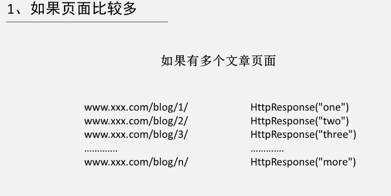

如果有许多相似的内容，我们可以将每个页面提取为一个模板，然后只需要定义一个模板，之后调用便可以满足需求

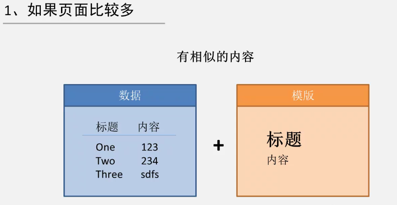

# 创建应用

命令：

```python
python manage.py startapp <应用名称>
```

执行完成后，在项目窗口可以看到新增了一个应用文件夹

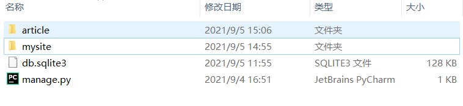

进入项目文件夹，models.py即定义模型的文件：

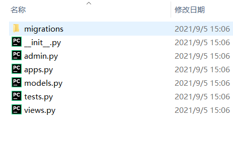

编辑models.py:

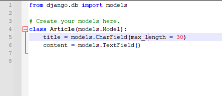

Article类定义了两个字段，title为char类型的字段，最长为30个字符，content为文本类型的字段

模型已经定义好了，但是我们还要在窗口中注册我们的应用，打开settings.py

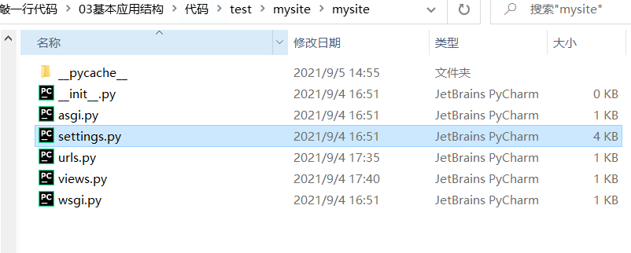

在INSTALLED_APPS里面引入我们的应用：

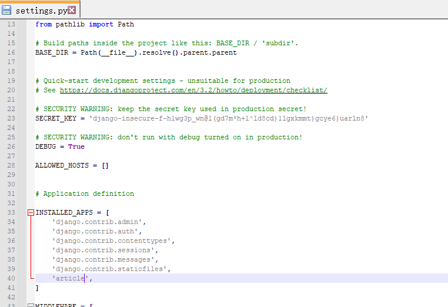

之后再进行一次迁移：

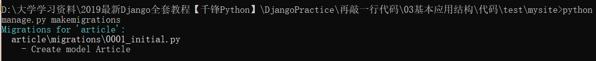

然后再输入`python manage.py migrate`进行应用

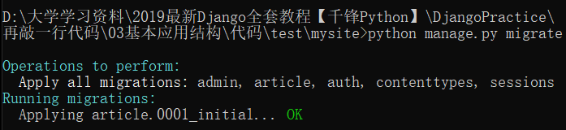

我们可以进入后台管理界面对此进行增删改查操作，但是我们要先进入应用编写应用里的admin.py

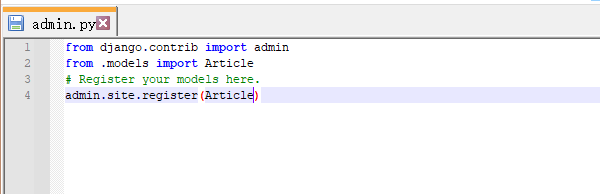

再进入即可看到：

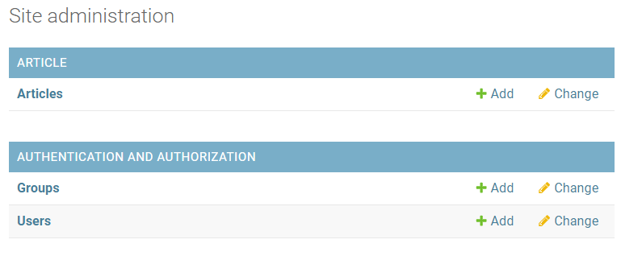

进入Article我们插入一些数据

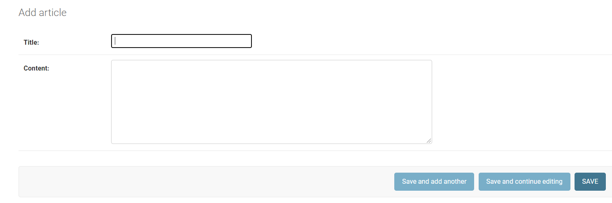

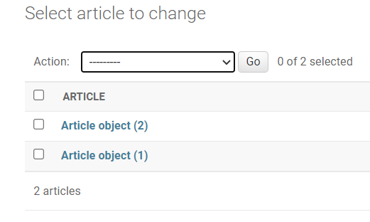

我们可以在全局设置，即settings.py里面将界面改成中文的

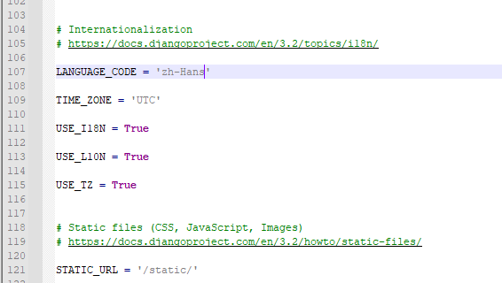

其实改不改无所谓，学学英文挺好的

