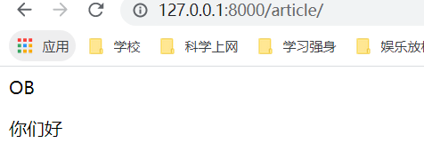

# 使用模板显示内容

如何通过一个处理方法获得不同文章？那么我们应该给文章定义一个唯一标识(简单来说就是主键)。

我们进入之前创建好的article模型中，点击migrations，打开`0001_initial.py`可以看到之前定义的模型的属性：


然后我们发现id已经被设置成了主键，那么就把它设置成为唯一标识就好了。

我们打开APP项目下的`views.py`，先尝试能不能返回文章的id:


然后再到主项目`mysite`下的urls.py中引用它，


启动服务，访问相关页面，成功了！


但是我们想把文章显示出来怎么办？那就需要模型的objects.


我们将views.py更改一下，看看能不能获取文章的标题：


进入浏览器：


再试试：


也可以加入html标签：


万一有人访问了不存在的文章id，那么我们应该返回一个错误：


不过用404更直观一些：


# 前后端分离

前后端分离才是开发的精髓，能够提高代码的维护性，我们要分离模板代码

我们在项目下创建一个`templates`文件夹，里面放入我们想要使用的模板页面：


编辑模板内容：


这要求我们处理函数返回一个字典类型的数据（也就是文章），然后从数据中取出title和content。


然后我们访问对应的文章页面：


成功了

当然你可以继续更改模板页面，调整成为自己想要的格式

我们使用`get_object_or_404()`函数调整一下返回404

```python
from django.shortcuts import render, get_object_or_404
from django.http import HttpResponse,Http404
from .models import Article
# Create your views here.
def article_detail(request, article_id):
    article = get_object_or_404(Article, pk=article_id)
    context = {}
    context['article_obj'] = article
    return render(request,"article_detail.html", context)
```

 整洁多了

# 获取文章列表

用户可能不知道我们有多少篇文章，每篇文章的ID是多少，所以我们需要一个方法来返回所有的文章号

```python
from django.shortcuts import render, get_object_or_404
from .models import Article
# Create your views here.
def article_detail(request, article_id):
    article = get_object_or_404(Article, pk=article_id)
    context = {}
    context['article_obj'] = article
    return render(request,"article_detail.html", context)
def article_list(request):
    articles = Article.objects.all()
    context = {}
    context['articles'] = articles
    return render(request,"article_list.html",context)
```

我们需要添加一个模板，模板名叫`article_list.html`

```html
<html>
    <head>
    </head>
    <body>
        {{articles}}
    </body>
</html>
```

在urls.py中引用：

```python
"""mysite URL Configuration

The `urlpatterns` list routes URLs to views. For more information please see:
    https://docs.djangoproject.com/en/3.2/topics/http/urls/
Examples:
Function views
    1. Add an import:  from my_app import views
    2. Add a URL to urlpatterns:  path('', views.home, name='home')
Class-based views
    1. Add an import:  from other_app.views import Home
    2. Add a URL to urlpatterns:  path('', Home.as_view(), name='home')
Including another URLconf
    1. Import the include() function: from django.urls import include, path
    2. Add a URL to urlpatterns:  path('blog/', include('blog.urls'))
"""
from django.contrib import admin
from django.urls import path
from . import views
from article.views import article_detail,article_list
urlpatterns = [
    path('admin/', admin.site.urls),
    path('', views.index),
    path('article/<int:article_id>',article_detail,name="article_detail"),
    path('article/',article_list,name="article_list"),
]
```

再次访问，可以看到相关数据：


可以看到获取到了一个列表

我们用for循环把列表里的东西读取出来

```html
<html>
    <head>
    </head>
    <body>
        
        <p>
            {{article.title}}
        </p>
        
    </body>
</html>
```



这是获取文章标题，我们把它做成跳转页面：

```html
<html>
    <head>
    </head>
    <body>
        
            <a href="/article/{{article.pk}}">{{article.title}}</a>
        
    </body>
</html>
```


通过模板标签实现：

```html
<html>
    <head>
    </head>
    <body>
        
            <a href="">{{article.title}}</a>
        
    </body>
</html>
```

改进一下主项目的urls.py,即每个app的urls只能由各自的urls.py编写：

主项目的：

```python
"""mysite URL Configuration
The `urlpatterns` list routes URLs to views. For more information please see:
    https://docs.djangoproject.com/en/2.0/topics/http/urls/
Examples:
Function views
    1. Add an import:  from my_app import views
    2. Add a URL to urlpatterns:  path('', views.home, name='home')
Class-based views
    1. Add an import:  from other_app.views import Home
    2. Add a URL to urlpatterns:  path('', Home.as_view(), name='home')
Including another URLconf
    1. Import the include() function: from django.urls import include, path
    2. Add a URL to urlpatterns:  path('blog/', include('blog.urls'))
"""
from django.contrib import admin
from django.urls import include, path
from . import views


urlpatterns = [
    path('admin/', admin.site.urls),
    path('', views.index),
    path('article/', include('article.urls'))
]
```

app的：

```python
from django.urls import path
from . import views

urlpatterns = [
    # localhost:8000/article/
    path('', views.article_list, name="article_list"),
    # localhost:8000/article/1/
    path('<int:article_id>', views.article_detail, name="article_detail"),
]
```

