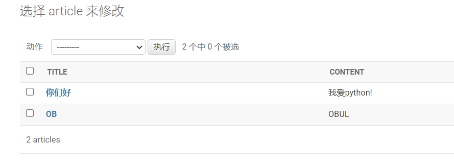

# 定制admin后台

启动服务，进入后台，我们发现之前创建的article表是以一个对象的形式展示出来的，我们想让这个文章直接显现出来而不是要点进去object才出现


在article的`models.py`中新建一个函数，返回一个字符串：

```python
from django.db import models

# Create your models here.
class Article(models.Model):
    title = models.CharField(max_length = 30)
    content = models.TextField()
    
    def __str__(self):
        return "<Article: %s>" % self.title

```


但是这个函数只是标注这个模型是什么，没有显示具体信息

我们编辑article模型下的`admin.py`:

```python
from django.contrib import admin
from .models import Article
# Register your models here.
class ArticleAdmin(admin.ModelAdmin):
    list_display = ("title","content")
admin.site.register(Article,ArticleAdmin)
```

刷新页面：



可以看到标题和具体内容了

要显示且根据主键id进行排序，那么应该这么编写：

```python
from django.contrib import admin
from .models import Article
# Register your models here.
@admin.register(Article)
class ArticleAdmin(admin.ModelAdmin):
    list_display = ("id","title","content")
    ordering = ("id",)

#admin.site.register(Article,ArticleAdmin)
```

需要倒序的话就把`ordering`里的`"id"`变为`"-id"`

# 修改模型

要修改模型的话，改完模型之后，一定要迁移到数据库！

两条指令：

```python
python manage.py makemigrations
python manage.py migrate
```

我们给article模型添加时间，一条为创建时间，一条为修改时间。

admin.py

```python
from django.contrib import admin
from .models import Article

# Register your models here.
@admin.register(Article)
class ArticleAdmin(admin.ModelAdmin):
    list_display = ("id", "title", "content", "author", "is_deleted", "created_time", "last_updated_time")
    ordering = ("-id",)

#admin.site.register(Article, ArticleAdmin)
```

models.py

```python
from django.db import models
from django.contrib.auth.models import User

# Create your models here.
class Article(models.Model):
    title = models.CharField(max_length=30)
    content = models.TextField()
    created_time = models.DateTimeField(auto_now_add=True)
    last_updated_time = models.DateTimeField(auto_now=True)
    author = models.ForeignKey(User, on_delete=models.DO_NOTHING, default=1)
    is_deleted = models.BooleanField(default=False)
    readed_num = models.IntegerField(default=0)

    def __str__(self):
        return "<Article: %s>" % self.title
```


